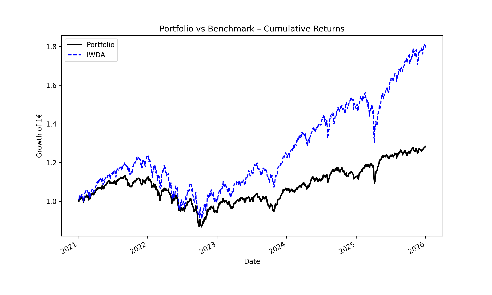
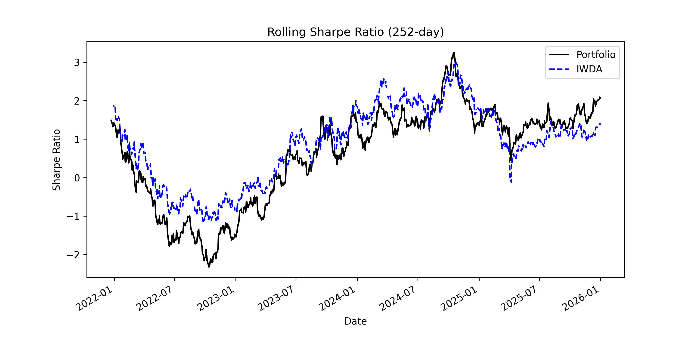
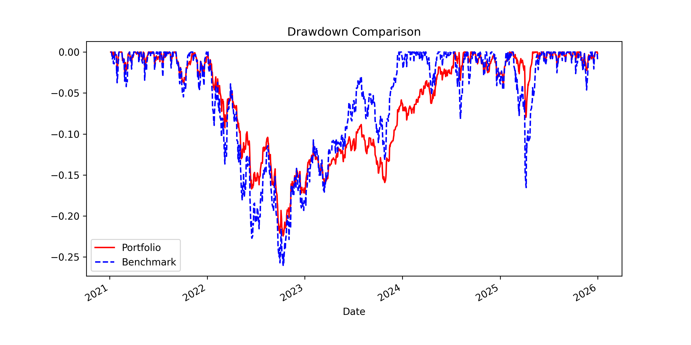
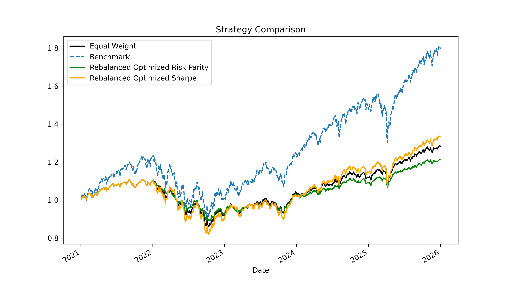

# Portfolio Analytics & Optimization

## Overview

This project analyzes the performance of a multi-asset portfolio compared to a benchmark (IWDA ETF), with a focus on **risk-adjusted returns**, **drawdowns**, and **portfolio optimization techniques**. 

The reason I built this is to understand why my portfolio was underperforming a simple global ETF (IWDA) and whether optimization techniques could improve it.

The analysis includes:

* Rolling Sharpe (252-day)
* Benchmark comparison
* Risk decomposition
* Portfolio optimization (Risk Parity, Max Sharpe)
* Yearly rebalancing

The goal is to answer three questions:

* Am I being compensated for the risk I'm taking?
* Can simple optimization techniques improve performance?
* Where is my risk actually coming from?

---

## Methodology

Data covers 5 years (2020-2025) using daily prices (source: ETF providers)

### Key Metrics

* **Total Return**
* **CAGR (Compound Annual Growth Rate)**
* **Volatility**
* **Sharpe Ratio**
* **Rolling Sharpe Ratio (252-day)**
* **Max Drawdown**

### Portfolio Strategies

1. **Original Portfolio** — baseline allocation, equal weighted
2. **Risk Parity Portfolio** — equal risk contribution across assets
3. **Max Sharpe Portfolio** — optimized for maximum risk-adjusted return
4. **Benchmark (IWDA ETF)** — global equity benchmark

---

## Results Summary

### Original Portfolio vs Benchmark

* Lower return and Sharpe ratio vs benchmark
* **Better downside protection** (lower drawdown)
* Risk is **highly concentrated** which limits diversification benefits and helps explain the weak Sharpe

### Risk Parity Portfolio

* Reduced volatility and drawdowns
* **Lower absolute returns and Sharpe**
* Improves diversification, but remains exposed to a few dominant risk drivers

### Max Sharpe Portfolio

* Higher return vs original portfolio
* Similar Sharpe to original
* **Higher drawdowns**, too aggressive for small improvement

---

## Key Metrics

| Portfolio   | CAGR   | Volatility | Sharpe | Max Drawdown |
| ----------- | ------ | ---------- | ------ | ------------ |
| Original    | 4.99%  | 7.58%      | 0.28   | -22.45%      |
| Benchmark   | 12.05% | 14.45%     | 0.67   | -26.04%      |
| Risk Parity | 3.81%  | 5.89%      | 0.16   | -19.67%      |
| Max Sharpe  | 5.78%  | 10.39%     | 0.31   | -26.16%      |

---

## Visualizations

### Portfolio vs Benchmark



### Rolling Sharpe Ratio (252-day)



### Drawdown Comparison



### Strategy Comparison



---

## Key Insights

* The benchmark significantly outperforms all portfolio strategies on a **risk-adjusted basis**
* The original portfolio offers **better downside protection**, but at the cost of lower returns
* Risk Parity reduces volatility, but the drop in returns is too large to justify it in this case
* Max Sharpe optimization increases returns but introduces **higher drawdown risk**
* All portfolios exhibit **risk concentration**, indicating potential for further diversification

---

## What I Learned

* Beating a global ETF like IWDA is harder than expected
* Optimization alone does not guarantee better outcomes
* Lower drawdowns usually come at a meaningful cost in returns
* My portfolio needs better diversification, not just reweighting

---

## Future Improvements

* Add **transaction costs**
* Include **additional asset classes** (commodities, bonds, alternatives)
* Implement **robust optimization techniques** (e.g. shrinkage, Black-Litterman)
* Perform **out-of-sample testing**
* Add **factor exposure analysis**

---

## Tech Stack

* Python (Pandas, NumPy)
* Matplotlib
* Jupyter Notebook

---

## How to Run

```bash
git clone https://github.com/FedericoGaravaglia/portfolio-analytics-python.git
cd portfolio-analytics-python
pip install pandas numpy matplotlib scipy
```

Run the notebook:

```bash
jupyter notebook notebook/analysis.ipynb
```

---

## Contact

Feel free to reach out if you have some feedback or if you'd like to discuss this project, or portfolio construction and quantitative finance more broadly.
